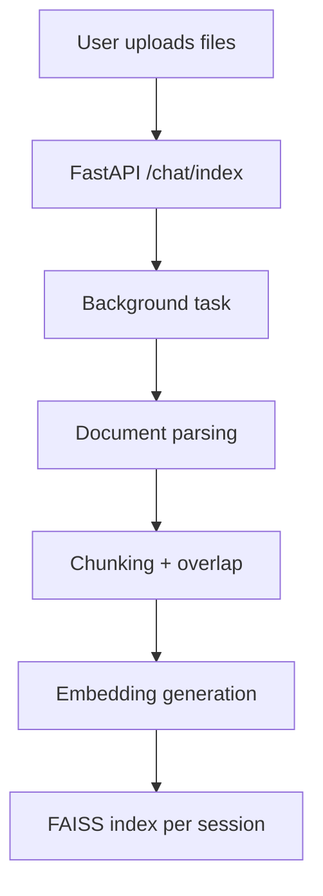
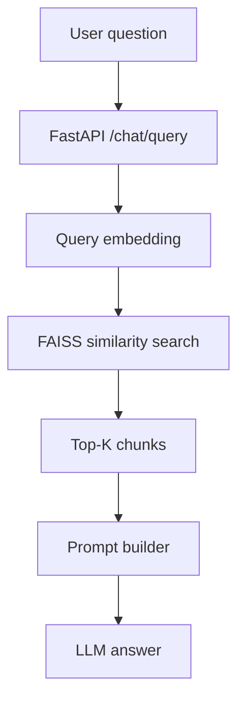

# DocuChat — RAG-Based Question Answering System

DocuChat is a **production-grade Retrieval-Augmented Generation (RAG) system** that lets users upload documents and ask contextual questions. It combines embeddings, FAISS similarity search, background ingestion, and an LLM-powered answer generator to deliver fast, accurate responses.

This project is designed to **demonstrate applied AI system design**—beyond simple prompt engineering.

---

## 🚀 Objective

Provide an API-driven system that:
- Accepts documents
- Indexes them using embeddings
- Retrieves relevant content via similarity search
- Generates accurate answers using an LLM
- Handles ingestion asynchronously
- Applies basic rate limiting
- Tracks meaningful metrics (e.g., latency)

The system is designed with production constraints such as latency, reliability, and observability in mind.

---

## 🧠 Key Features

- 📁 Document upload support (`.pdf`, `.txt`)
- ✂️ Intelligent chunking strategy
- 🔢 Embedding generation using SentenceTransformers
- 📦 Vector storage using **FAISS** (local)
- 🔍 Similarity-based retrieval (Top‑K)
- 🤖 LLM-powered answer generation (Groq / OpenAI-compatible)
- 🧵 Background ingestion jobs
- 🚦 API rate limiting
- 📊 Metric logging (latency, similarity distance)
- 🌐 Simple web UI (HTML + CSS)
- 🧩 Session-based FAISS indexing (isolated per user session)

---

## 🛠️ Tech Stack

| Layer            | Technology                                   |
|------------------|----------------------------------------------|
| API              | FastAPI                                      |
| Embeddings       | sentence-transformers (MiniLM-L6-v2)         |
| Vector Store     | FAISS (local)                                |
| LLM              | Groq / OpenAI-compatible                     |
| Background Jobs  | FastAPI `BackgroundTasks`                    |
| Validation       | Pydantic                                     |
| Rate Limiting    | SlowAPI                                      |
| UI               | HTML + CSS                                   |
| Logging          | Custom structured logger                     |

---

## 📁 Project Structure

```text
.
├── api/
│   └── main.py                  # FastAPI application
├── src/
│   └── DocumentChat/
│       ├── ingestion.py         # Document ingestion & FAISS indexing
│       └── retrieval.py         # Retrieval + answer generation
├── utils/
│   ├── document_ops.py          # File abstraction & parsing
│   ├── model_loader.py          # Embeddings + LLM loader
│   └── config_loader.py         # YAML config loader
├── prompt/
│   └── prompt_library.py        # Centralized prompt templates
├── models/
│   └── models.py                # Pydantic request/response models
├── exception/
│   └── custom_exception.py      # Custom exception handling
├── logger/
│   └── custom_logger.py         # Structured logging
├── config/
│   └── config.yaml              # Chunking, model, retrieval configs
├── templates/
│   └── index.html               # Web UI
├── static/
│   └── style.css                # UI styling
├── faiss_index/                 # Generated FAISS indexes (runtime)
├── data/                        # Uploaded files (runtime)
├── requirements.txt
├── setup.py
├── README.md
```

---

## ⚙️ Setup & Installation

### 1️⃣ Clone the repository

```bash
git clone https://github.com/your-username/docuchat.git
cd docuchat
```

### 2️⃣ Create and activate a virtual environment

```bash
python -m venv venv
source venv/bin/activate
```

### 3️⃣ Install dependencies

```bash
pip install -r requirements.txt
```

### 4️⃣ Configure environment variables

Create a `.env` file or export variables in your shell:

```bash
export GROQ_API_KEY=your_key_here
export GOOGLE_API_KEY=optional
export HF_TOKEN=optional
```

### 5️⃣ Run the application

```bash
uvicorn api.main:app --reload
```

The application will be available at:

- Local: `http://127.0.0.1:8000`

---

## 🏗️ System Architecture (High Level)

```text
Web UI (HTML / JS)
        ↓
FastAPI Backend
        ↓
Background Ingestion Engine
        ↓
Chunking & Embeddings
        ↓
FAISS Vector Store
        ↓
Retriever (Top-K)
        ↓
Prompt Construction
        ↓
LLM (Groq / Gemini)
```

---

## 🧩 Detailed Architecture Diagrams

### 1️⃣ Document Ingestion Flow



### 2️⃣ RAG Question Answering Flow



---

## 🔌 API Endpoints

| Endpoint       | Method | Purpose                  |
|---------------|--------|--------------------------|
| /chat/index   | POST   | Index uploaded documents |
| /chat/query   | POST   | Ask questions            |
| /health       | GET    | Service health check     |

---

## 🧠 Model Selection Justification

### 🔢 Embedding Model

- **Model:** `sentence-transformers/all-MiniLM-L6-v2`
- **Reasons for choice:**
  - Fast embedding generation
  - Low memory footprint (384-dimensional vectors)
  - Strong semantic similarity performance
  - Well-suited for FAISS-based local retrieval

### 🤖 Language Model (LLM)

- **Primary LLM:** Groq (OSS LLaMA-family)
- **Secondary / fallback:** Google Gemini

**Rationale:**
- Groq offers very low latency, ideal for interactive APIs.
- Gemini provides stable reasoning and structured output.
- The abstraction layer allows easy future model swapping.

---

## 📐 Design Decisions

### ✅ Chunk Size Choice

- **Chunk size:** ~500 characters
- **Overlap:** ~100 characters

**Reasoning:**
- Preserves semantic meaning across sentence boundaries
- Prevents loss of context during retrieval
- Balances recall vs. precision
- Avoids overly large chunks that degrade embedding quality

This configuration performed best during testing for both retrieval accuracy and latency.

### ❌ Observed Retrieval Failure Case

**Scenario:**
- User asked a question that was **not present** in the uploaded documents.

**Observed behavior:**
- FAISS returned low-similarity chunks.
- Prompt logic correctly responded with: _"I don’t know."_

**Why this is acceptable:**
- Prevents hallucinations
- Improves trustworthiness
- Aligns with enterprise RAG best practices

---

## 📊 Metrics Tracked

- **Primary metric:** End-to-end query latency (ms)

Latency is logged at:
- Retrieval stage
- LLM invocation
- Full request lifecycle

**Why it matters:**
- Directly impacts user experience
- Helps identify bottlenecks (embedding vs. LLM)
- Informs future optimization and scaling efforts

---


## 🧑‍💻 Author

**Niraj Kumar**  
Aspiring GenAI Engineer

**GitHub:** https://github.com/nirajj12

⭐ If you found this project useful, consider starring the repository!
